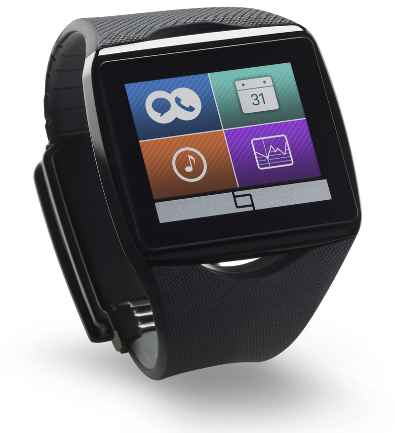
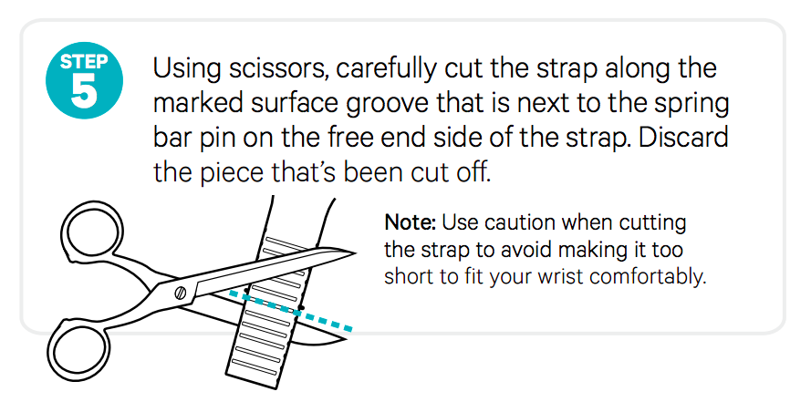
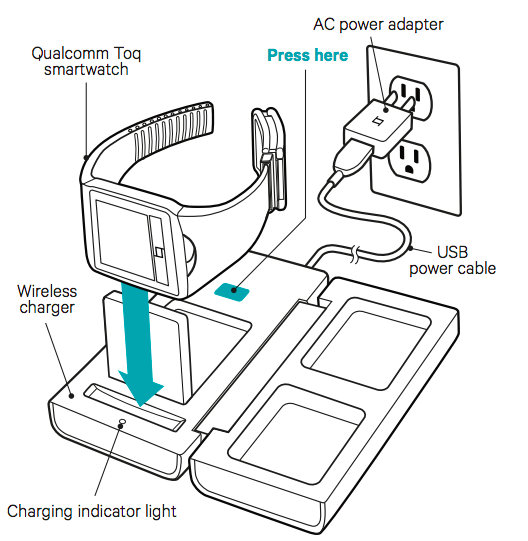

# Heron's Study on Smart Watches

## 01. Toq (Qualcomm)

### A. Sales Point

- Qualcomm® Mirasol™ color touchscreen display (screen is visible even in bright sunlight)
- Always on for multi-days

### B. Specs

**Platform**

- Android / Bluetooth

**Input Method**

- Home/Lock touch sensor
- Clock Face slider
- Touch screen
- Light touch sensor

**Application**

- Applets (no custom applications)

**Price**

- \$350

**Other**

- Charger Stand
- Color E-Ink style display

### C. News (Success or Failure Stories) / Product Events (Timeline)

- 2013.09: Release (was competing with Samsung Galaxy Gear)

### D. Own Ideas

- Terrible watchband design
- [CNET - Qualcomm Toq smartwatch: Mirasol display, long battery life, expensive (hands-on)](http://www.cnet.com/products/qualcomm-toq/)

### E. Photos

